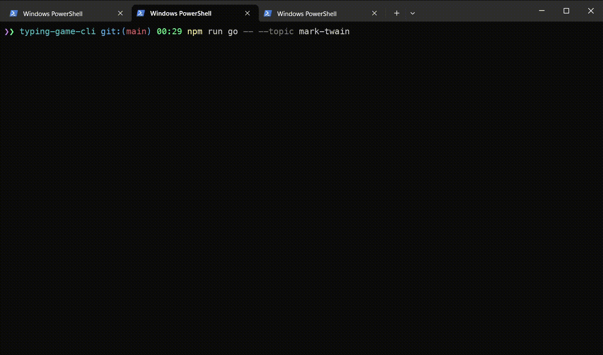
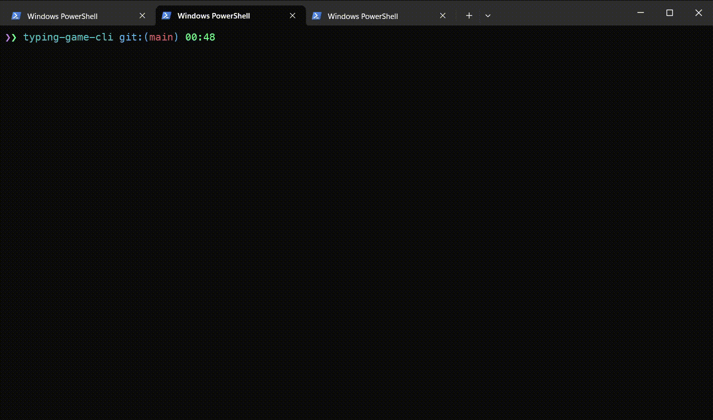

### Demos

#### Round against robot having X typing speed

'X' can be high, extra hight, medium, low: to compete against fast level one would issue the following command:

```bash
$ typing-game-cli --fast
```

or shorter version:

```bash
$ typing-game-cli -f
```


#### With handicap

For this case you need to specify handicap option along with count of words you would wish ahead against your opponent. For example to compete against fast level robot the command would be the following:

```bash
$ typing-game-cli --handicap --handicap-count 9 --fast
```

or shortcut version:

```bash
$ typing-game-cli --ha --haco 9 -f
```


#### Round against your best result

To compete against your best result you would use `--against-my-best`, or its aliases: `-b`, `--my-best`, `--myself`, `--best`.

```bash
$ typing-game-cli --against-my-best
```

or shorter version:

```bash
$ typing-game-cli --against-my-best
```


#### With specified topic to be used as a source text

One can specify a topic to use a source text for different sources, for example, ambrose-bierce, mark-twain, o-henry.

```bash
$ typing-game-cli --topic mark-twain
```



#### Other examples

Let's say we have run a game round with extra high level robot, and an ahead of 12 words, with Mark Twain topic:

```bash
$ typing-game-cli --extra-fast --handicap --handicap-count 12 --topic mark-twain
```

or shorter version:

```bash
$ typing-game-cli -e --han --haco 12 -t mark-twain
```


