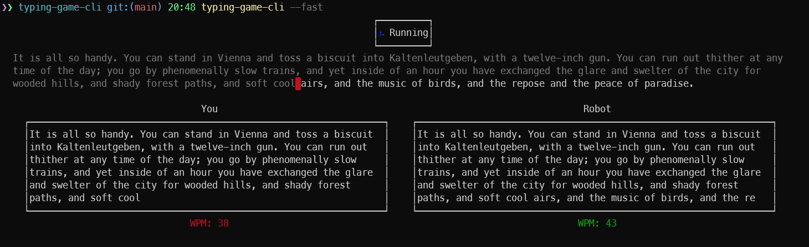

# typing-game-cli [![NPM version][npm-image]][npm-url]

> Command line game to practice your typing speed by competing against typer-robot.

## Install

```bash
$ npm install --global typing-game-cli
```

## CLI

```
$ typing-game-cli --help

  Command line game to practice your typing speed by competing against typer-robot

  Usage
    $ typing-game-cli

  Options
        --fast            Start a round with a robot having high typing speed.
        --extra-fast      Start a round with a robot having high typing speed.
        --medium          Start a round with a robot having medium typing speed.
        --low             Start a round with a robot having low typing speed.
        --display-results Show wpm results
        --sort-by         Sort wpm results by specified value (-wpm, wpm, -date, date), Starting "-" indicates descending order, default is "-date"


  Examples
    $ typing-game-cli
    $ typing-game-cli --fast
    $ typing-game-cli -f
    $ typing-game-cli --extra-fast
    $ typing-game-cli --medium
    $ typing-game-cli -m
    $ typing-game-cli --low
    $ typing-game-cli --display-results
    $ typing-game-cli -r
    $ typing-game-cli -r --sort-by="-wpm"
    $ typing-game-cli -r -s="wpm"
```

## Demo


## Screenshots



## License

MIT © [Rushan Alyautdinov](https://github.com/akgondber)

[npm-image]: https://img.shields.io/npm/v/typing-game-cli.svg?style=flat
[npm-url]: https://npmjs.org/package/typing-game-cli
