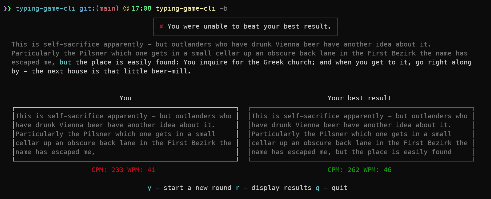

# typing-game-cli [![NPM version][npm-image]][npm-url]

> Command-line game to practice your typing speed by competing against typer-robot or against your best result.

## Install

```bash
$ npm install --global typing-game-cli
```

## CLI

```
  Command line game to practice your typing speed by competing against typer-robot or against your best result

  Usage
    $ typing-game-cli

  Shorthand command aliases:
    $ typing-game
    $ tpngm
    $ tgc

  Options
    --against-my-best Play against your best result (available after you have competed against a robot at least once)
    --fast            Start a round with a robot having high typing speed.
    --extra-fast      Start a round with a robot having extra high typing speed.
    --medium          Start a round with a robot having medium typing speed.
    --low             Start a round with a robot having low typing speed.
    --display-results Show cpm and wpm results
    --sort-by         Sort results by specified value (-cpm, cpm, -wpm, wpm, -date, date), Starting "-" indicates descending order, default is "-date"
    --all-hostory     Show all history when displaying results (otherwise (default) display last 10 results respecting sorting parameter)
    --compact-result  Display top result in compact format

  Short flags and aliases for options:
    --against-my-best:  -b, --best, --my-best, --myself, --against-my-best-result
    --fast:             -f
    --extra-fast:       -e
    --medium:           -m
    --low:              -l
    --display-results:  -r
    --sort-by           -s
    --show-all-history: -a, --all, --all-history
    --clear-results:    -c, --clear
    --compact-result    --cmpc


  Examples
    $ typing-game-cli
    $ typing-game-cli --fast
    $ typing-game-cli -f
    $ typing-game-cli --extra-fast
    $ typing-game-cli --medium
    $ typing-game-cli -m
    $ typing-game-cli --low
    $ typing-game-cli --display-results
    $ typing-game-cli -r
    $ typing-game-cli -r --sort-by="-wpm"
    $ typing-game-cli -r -s="wpm"
    $ typing-game-cli -r -s="-wpm" --all-history
    $ typing-game-cli -r -s="-wpm" -a
```

## Demo


## Screenshots

### Competition against fast robot

```
$ typing-game-cli --fast
```


### Competition against best result

```
$ typing-game-cli --my-best
# There are available the following aliases:
$ typing-game-cli --myself
$ typing-game-cli -b
$ tgc -b
```

#### Example - Running game


#### Example - Game over



## License

MIT © [Rushan Alyautdinov](https://github.com/akgondber)

[npm-image]: https://img.shields.io/npm/v/typing-game-cli.svg?style=flat
[npm-url]: https://npmjs.org/package/typing-game-cli
